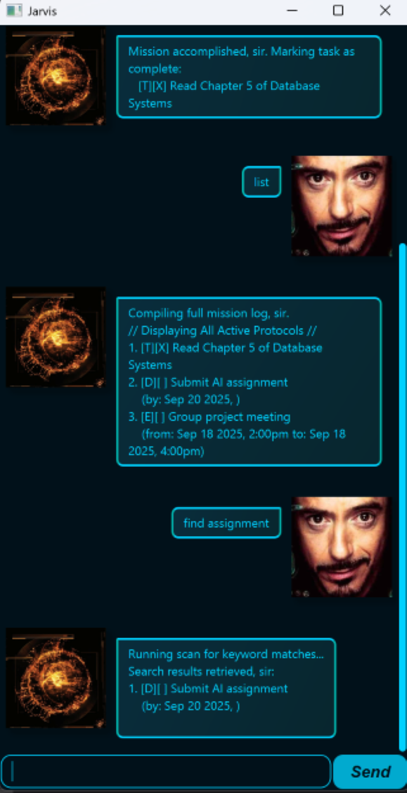

# Jarvis User Guide

## 📖 Introduction


Jarvis is a command-line and chat-based task management assistant that helps you organize your tasks efficiently.

He understands natural language commands and supports multiple task types with features like deadlines, events, searching, and persistent storage. 

Jarvis can be run in the terminal or through a GUI-style chat window, offering a more interactive assistant experience.

## ✨ Features

### ✅ Adding a todo task

The user enters the todo command followed by the task description and Jarvis interprets it as a request to add a new todo task.

Format: `todo <task_description>`

Example: `todo Read Chapter 5 of Database Systems`

```
Protocol initiated. Task archived:
   [T][ ] Read Chapter 5 of Database Systems 
Sir, the list now doesContain 3 active missions.
```

### ⏰ Adding a deadline task

The user enters the deadline command followed by the task description and the due date/time, and Jarvis interprets it as a request to add a new deadline task.

Format: `deadline <task_description>/by <year>-<month>-<day> <hour><minute>`

Example: `deadline Submit assignment/by 2025-09-30 2359`

```
Protocol initiated. Task archived:
   [D][ ] Submit assignment 
    (by: Sep 30 2025, 11:59pm)
Sir, the list now doesContain 4 active missions.
```


### 📅 Adding an event task

The user enters the event command followed by the task description and the event date/time, and Jarvis interprets it as a request to add a new event task.

Format: `event <task_description>/from <year>-<month>-<day> <hour><minute>/to <year>-<month>-<day> <hour><minute>`

Example: `event Team meeting/from 2025-10-01 1400/to 2025-10-01 1500`

```
Protocol initiated. Task archived:
   [E][ ] Team meeting 
    (from: Oct 1 2025, 2:00pm to: Oct 1 2025, 3:00pm)
Sir, the list now doesContain 5 active missions.
```

### 📋 Listing all tasks

The user enters the list command, and Jarvis interprets it as a request to display all current tasks.

Format: `list`

Example: `list`

```
Compiling full mission log, sir.
// Displaying All Active Protocols //
1. [E][ ] Group project meeting 
    (from: Sep 18 2025, 2:00pm, to: Sep 18 2025, 4:00pm)
2. [D][ ] Submit assignment 
    (by: Sep 30 2024, 11:59pm)
3. [E][ ] Team meeting 
    (from: Oct 1 2025, 2:00pm, to: Oct 1 2025, 3:00pm)
```

### ✔️ Marking a task as done

The user enters the mark command followed by the task number, and Jarvis interprets it as a request to mark the specified task as completed.

Format: `mark <task_number>`

Example: `mark 2`

```
Mission accomplished, sir. Marking task as complete:
   [D][X] Submit assignment 
    (by: Sep 30 2024, 11:59pm)
```

### 🔄 Unmarking a task

The user enters the unmark command followed by the task number, and Jarvis interprets it as a request to mark the specified task as not completed.

Format: `unmark <task_number>`

Example: `unmark 2`

```
Status update: Task reverted to pending, sir.
   [D][ ] Submit assignment 
    (by: Sep 30 2024, 11:59pm)
```

### 🗑️ Deleting a task

The user enters the delete command followed by the task number, and Jarvis interprets it as a request to remove the specified task from the list.

Format: `delete <task_number>`

Example: `delete 3`

```
Targeted deletion complete, sir.
Removed:
   [E][ ] Team meeting 
    (from: Oct 1 2025, 2:00pm, to: Oct 1 2025, 3:00pm)
The registry now holds 2 active missions.
```

### 🔍 Finding tasks by keyword

The user enters the find command followed by a keyword, and Jarvis interprets it as a request to search for tasks containing that keyword.

Format: `find <keyword>`

Example: `find assignment`

```
Running scan for keyword matches...
Search results retrieved, sir:
1. [D][ ] Submit assignment 
    (by: Sep 30 2024, 11:59pm)
```

### 🏷️ Tagging a task

The user enters the tag command followed by the task number and the tag name, and Jarvis interprets it as a request to add a tag to the specified task.

Format: `tag <task_number>/<tag_name>`

Example: `tag 2/urgent`

```
Consider it done, sir. Tag successfully applied:
   [D][ ] Submit assignment #urgent 
    (by: Sep 30 2024, 11:59pm)
```

### 🚪 Exiting the application

The user enters the bye command, and Jarvis interprets it as a request to exit the application.

Format: `bye`

Example: `bye`

```
!! Powering down auxiliary systems.
As always, a pleasure to serve, sir.
```